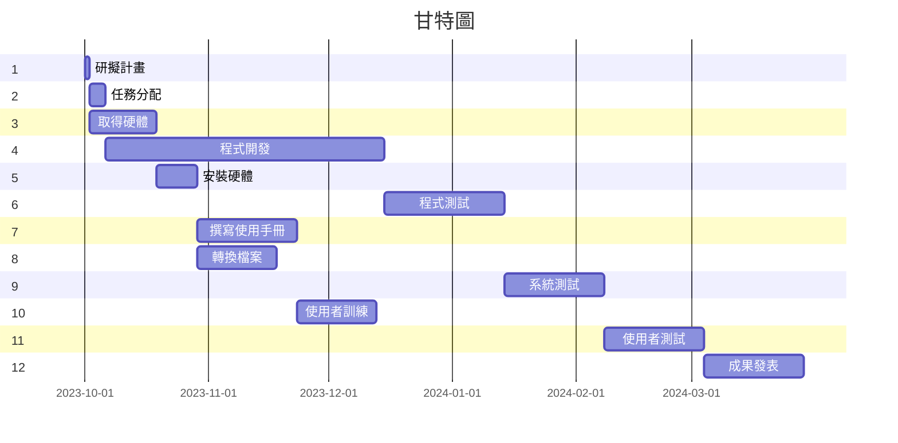

第6組:
分配圖
| 任務 | 說明 | 需時(天) | 前置任務 |
|:-------------|:---------------:|-----:|:---------------:|
| 1 | 研擬計畫 | 1d | - |
| 2 | 任務分配 | 4d | 1 |
| 3 | 取得硬體 | 17d | 1 |
| 4 | 程式開發 | 70d | 2 |
| 5 | 安裝硬體 | 10d | 3 |
| 6 | 系統測試 | 30d | 4 |
| 7 | 撰寫使用者手冊 | 25d | 5 |
| 8 | 轉換檔案 | 20d | 5 |
| 9 | 系統測試 | 25d | 6 |
| 10 | 使用者訓練 | 20d | 7,8 |
| 11 | 使用者測試 | 25d | 9,10 |
| 12 | 成果發表 | 25d | 11 |

