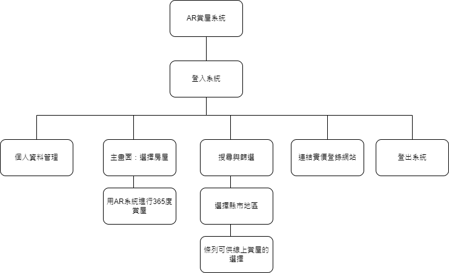
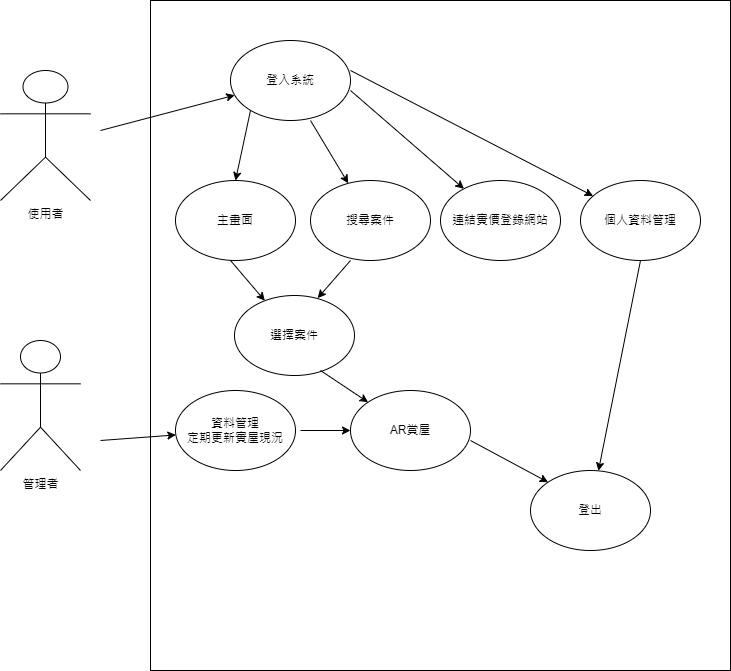

# 功能性需求
```
1. 用戶註冊與個人資料管理
2. 條列式選擇賞屋
3. 搜尋與篩選地區
4. 連結房地產實價登錄網站
5. 登出系統
```
# 非功能性需求
```
1. 介面登入速度在10秒以內
2. 顧客的隱私應該受到保護
3. 確保能在Andriod及ios系統上順暢運行
4. 維護人員應盡速回覆客戶意見
```
# 功能分解圖

# 需求分析的文字描述
```
1.使用者輸入帳號密碼登入
2.主畫面優先顯示上次瀏覽過的房屋
3.最上方搜尋欄可找尋想要的縣市地區
4.點選案件後即可用手機觀看AR物件
5.下方控制區則有連結實價登錄網站
6.右上角有登出按鈕
```
# 使用案例圖

# 使用案例說明
| 使用案例名稱   |  登入系統   |
| :------   | :----  |
| 行動者  | 欲賞屋者 |
| 說明  | 描述賞屋者登入 |
| 完成動作  | 1.選擇登入或註冊<br> 2.註冊:輸入個人資料，以信箱、密碼作為登入帳密<br>3.登入:輸入帳密後登入成功|
| 替代方法  | 1.選擇登入或註冊<br> 2.註冊:輸入個人資料，以信箱、密碼作為登入帳密<br>3.登入:輸入帳密後登入失敗 |
| 先決條件  | 使用者必須先註冊或登入 |
| 後置條件  | 使用者可選擇記住我下次就不用輸入帳密 |
| 假設  | 無 |
# Figma
